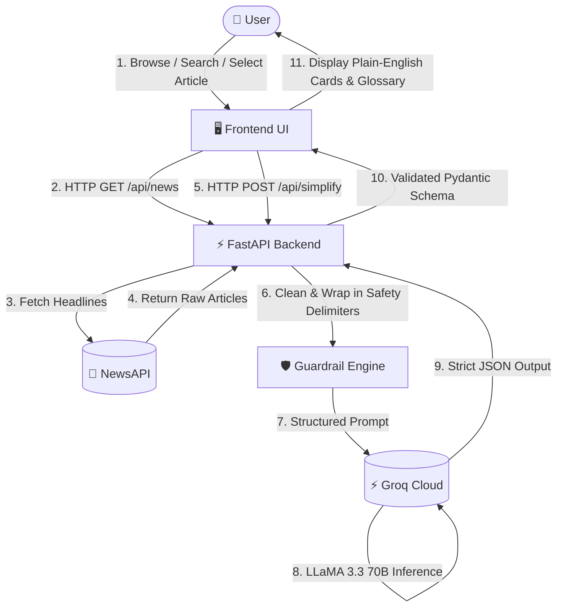

# 📈 FinNews AI — Financial News Simplification Platform

> **Transforming complex financial news and Wall Street jargon into crystal-clear, beginner-friendly explanations with Groq LLaMA 3.3 70B & FastAPI.**

[](https://python.org)
[](https://fastapi.tiangolo.com)
[](https://groq.com)
[](https://newsapi.org)
[](LICENSE)

---

## 📖 Overview

Financial news and macroeconomic reporting are often filled with dense jargon, complex acronyms (*EBITDA, Basis Points, Quantitative Tightening, Yield Curve Inversion*), and convoluted analysis that make them difficult for everyday readers to understand.

**FinNews AI** bridges this gap by automatically fetching live global financial news and utilizing Groq's high-speed **LLaMA 3.3 70B Versatile** large language model to translate complex financial articles into plain, accessible, and structured English.

### Who is it for?
* 🎓 **Students & Beginners**: Learn economics and finance through real-world news without getting lost in technical terminology.
* 💼 **Retail Investors**: Understand the core facts, market context, and implications behind breaking news stories quickly.
* 📱 **Everyday Consumers**: Discover how Federal Reserve decisions, inflation figures, and market movements impact mortgages, savings, and living costs.

---

## ✨ Features

- 📰 **Real-Time Financial News Stream**: Live news ingestion filtered across categories (*All, Markets, Economy, Business, Technology*).
- 🔍 **Interactive Keyword Search**: Search across global financial headlines, company tickers, and economic subjects.
- ⚡ **AI-Powered News Simplification**: 2-3 sentence plain-English summaries powered by **Groq LLaMA 3.3 70B Versatile**.
- 💡 **Financial Jargon Decoded**: Automatically identifies complex terms and provides clear, beginner-friendly definitions.
- 🎯 **Key Takeaways**: Extracts crucial numerical figures, dates, and milestone developments.
- 📊 **Objective Market Relevance**: Explains how sector or policy shifts influence broader markets without offering financial advice.
- 👥 **Affected Groups Breakdown**: Highlights specific demographic or economic groups impacted (e.g., *Borrowers, Homeowners, Tech Firms*).
- 🛡️ **Prompt Injection Guardrails**: Strict untrusted input delimiters (`<<<UNTRUSTED_ARTICLE_CONTENT>>>`) defend against prompt exploits.
- ⚡ **In-Memory TTL Caching**: High-efficiency caching engine reduces redundant external API calls to NewsAPI and Groq.
- 📦 **Batch Article Simplification**: Simplifies up to 10 articles concurrently with semaphore-bounded concurrency control.
- 🎨 **Modern Fintech UI**: Responsive interface with dark/light mode toggle and interactive modal states.
- 🚀 **Asynchronous FastAPI Backend**: Production-ready async REST API with strict Pydantic v2 schema validation.

---

## 🧠 How It Works



### Process Flow:
1. **News Retrieval**: The backend queries NewsAPI for the latest verified financial reports, deduplicating articles by canonical URL and title signatures.
2. **Sanitization & Isolation**: HTML tags, script blocks, and tracking artifacts are stripped. The article text is wrapped in prompt injection isolation boundaries.
3. **LLaMA 3.3 70B Inference**: Groq processes the structured prompt and generates a strict JSON payload containing summaries, takeaways, jargon definitions, and context.
4. **Validation & Rendering**: FastAPI validates the response via Pydantic schemas and delivers it to the frontend for instant viewing.

---

## 🏗️ Project Architecture

```text
Financial-News-Simplifier/
│
├── backend/
│   ├── app/
│   │   ├── api/
│   │   │   ├── health.py                 # /health monitoring endpoint
│   │   │   ├── news.py                   # /api/news and /api/news/search endpoints
│   │   │   └── simplify.py               # /api/simplify and /api/simplify/batch endpoints
│   │   ├── core/
│   │   │   ├── config.py                 # Pydantic BaseSettings & masked logging
│   │   │   └── logging_config.py         # Structured application logger
│   │   ├── schemas/
│   │   │   ├── news_schema.py            # Article, NewsResponse, ErrorResponse schemas
│   │   │   └── summary_schema.py         # SimplificationResult & Request schemas
│   │   ├── services/
│   │   │   ├── groq_service.py           # Groq LLaMA 3.3 70B integration & JSON parser
│   │   │   ├── news_service.py           # NewsAPI client, deduplication & TTL cache
│   │   │   └── summarization_service.py  # Orchestration & concurrency control
│   │   ├── utils/
│   │   │   ├── prompts.py                # System prompts & injection guardrails
│   │   │   └── text_cleaner.py           # HTML stripping & text sanitization
│   │   ├── __init__.py
│   │   └── main.py                       # FastAPI entrypoint, CORS & error handlers
│   ├── tests/
│   │   ├── conftest.py                   # Pytest fixtures & mock payloads
│   │   ├── test_health.py                # Health check & root route tests
│   │   ├── test_news.py                  # NewsAPI caching & deduplication tests
│   │   └── test_simplify.py              # AI inference, JSON parser & batch tests
│   ├── .env.example                      # Safe environment variables template
│   ├── README.md                         # Backend-specific guide
│   └── requirements.txt                  # Python dependencies
│
├── frontend/
│   ├── index.html                        # Single-page application markup
│   ├── styles.css                        # Modern fintech styling & dark mode tokens
│   └── app.js                            # Frontend UI logic, state & API client
│
├── .gitignore                            # Git ignore rules
├── LICENSE                               # MIT License
├── package.json                          # Concurrently runner scripts
└── README.md                             # Master project documentation
```

---

## 🛠️ Tech Stack

| Layer | Technology | Purpose |
|:---|:---|:---|
| **Frontend** | HTML5, CSS3, JavaScript (ES6+) | Lightweight, zero-dependency fintech user interface |
| **Backend** | Python 3.11+, FastAPI, Uvicorn | High-performance asynchronous REST API |
| **AI Engine** | Groq Cloud API | Ultra-low latency LLaMA 3.3 70B Versatile inference |
| **Data Ingestion** | NewsAPI | Real-time global financial news and market feeds |
| **Validation** | Pydantic v2 & Pydantic-Settings | Strict request/response validation and settings management |
| **HTTP Client** | `httpx` (async) | Async connection pooling, retries, and timeout management |
| **Testing** | `pytest`, `pytest-asyncio`, `pytest-mock` | Comprehensive unit and integration test coverage |

---

## 🚀 Getting Started

### Prerequisites

* **Python**: `3.11` or higher
* **Node.js & npm** *(Optional)*: For running frontend and backend concurrently via `npm run dev`
* **API Keys**:
  * [Groq API Key](https://console.groq.com) (Free tier available)
  * [NewsAPI Key](https://newsapi.org) (Free tier available)

---

### Installation & Setup

#### 1. Clone the Repository
```bash
git clone https://github.com/bbhagyashri928-max/Financial-News-Simplifier.git
cd Financial-News-Simplifier
```

#### 2. Configure Environment Variables
Create a `.env` file inside the `backend/` directory from the template:

```bash
# Windows
copy backend\.env.example backend\.env

# Linux / macOS
cp backend/.env.example backend/.env
```

Edit `backend/.env` with your API credentials:
```env
NEWS_API_KEY=your_newsapi_key_here
GROQ_API_KEY=your_groq_api_key_here
GROQ_MODEL=llama-3.3-70b-versatile
BACKEND_HOST=0.0.0.0
BACKEND_PORT=8000
ENVIRONMENT=development
FRONTEND_ORIGIN=http://localhost:5500,http://127.0.0.1:5500
NEWS_CACHE_MINUTES=10
MAX_ARTICLE_LENGTH=12000
```

> [!WARNING]
> Never commit `.env` files, API keys, tokens, or other secrets to GitHub.

---

### Running the Application

#### Option A: Quickstart via npm (Recommended)
If you have Node.js installed, start both backend and frontend concurrently:
```bash
npm install
npm run dev
```

#### Option B: Manual Setup

**Terminal 1 — Backend (FastAPI)**:
```bash
cd backend
python -m venv venv

# Activate virtual environment
# Windows:
venv\Scripts\activate
# Linux/macOS:
source venv/bin/activate

# Install dependencies
pip install -r requirements.txt

# Start FastAPI server
uvicorn app.main:app --reload --port 8000
```

**Terminal 2 — Frontend**:
```bash
cd frontend
python -m http.server 5500
```

---

## 🌐 Application URLs

| Service | URL | Description |
|:---|:---|:---|
| **Frontend UI** | `http://localhost:5500` | News feed and AI simplification dashboard |
| **Backend API** | `http://localhost:8000` | Root status metadata endpoint |
| **Swagger UI** | `http://localhost:8000/docs` | Interactive API documentation |
| **ReDoc UI** | `http://localhost:8000/redoc` | Clean alternate API documentation |

---

## 📡 API Endpoints

### 1. Root & Health

#### `GET /`
Returns service operational status and metadata.
```json
{
  "name": "FinNews AI",
  "description": "AI-powered financial news simplification platform",
  "version": "1.0.0",
  "status": "running"
}
```

#### `GET /health`
Returns configuration health without exposing secrets.
```json
{
  "status": "healthy",
  "service": "FinNews AI",
  "news_api_configured": true,
  "groq_configured": true
}
```

---

### 2. Financial News

#### `GET /api/news`
Fetches verified, normalized, and deduplicated financial news articles.

| Parameter | Type | Default | Description |
|:---|:---|:---|:---|
| `category` | `string` | `"all"` | Filter: `all`, `markets`, `economy`, `business`, `technology` |
| `query` | `string` | `null` | Optional search keyword or ticker symbol |
| `page` | `integer` | `1` | Page number (`1` to `20`) |
| `page_size` | `integer` | `10` | Articles per page (`1` to `50`) |

#### `GET /api/news/search`
Searches articles by query string.

| Parameter | Type | Required | Description |
|:---|:---|:---|:---|
| `query` | `string` | **Yes** | Search keyword, company name, or ticker |
| `page` | `integer` | No (`1`) | Page number |
| `page_size` | `integer` | No (`10`) | Articles per page |

---

### 3. AI Simplification

#### `POST /api/simplify`
Simplifies a single financial news article into plain English.

**Request Body**:
```json
{
  "title": "Federal Reserve Holds Interest Rates Steady Amid Inflation Easing",
  "description": "The Federal Reserve left its benchmark lending rate unchanged at 5.25%-5.50%...",
  "content": "The Federal Open Market Committee concluded its two-day meeting today...",
  "source": "Financial Times",
  "url": "https://example.com/article"
}
```

**Response**:
```json
{
  "status": "success",
  "article": {
    "title": "Federal Reserve Holds Interest Rates Steady Amid Inflation Easing",
    "source": "Financial Times",
    "url": "https://example.com/article"
  },
  "simplification": {
    "simple_summary": "The Federal Reserve decided not to change interest rates, keeping them between 5.25% and 5.50%. Officials noted that while inflation has slowed down, they want to see further progress before considering rate cuts.",
    "key_points": [
      "Interest rates remain unchanged at 5.25% - 5.50%.",
      "Inflation is declining towards the 2% target, but central bankers remain cautious.",
      "No immediate rate cuts are expected in the next meeting."
    ],
    "financial_terms": [
      {
        "term": "Federal Reserve",
        "explanation": "The central banking system of the United States that manages monetary policy and sets interest rates."
      },
      {
        "term": "Benchmark Rate",
        "explanation": "The baseline interest rate set by the central bank that influences borrowing costs across banks and consumers."
      }
    ],
    "why_it_matters": "When interest rates stay high, borrowing money for mortgages, cars, and credit cards remains expensive, but savings accounts generally earn higher interest.",
    "market_relevance": "Stock markets often react positively to signs that rate hikes have concluded, while bond yields stabilize.",
    "affected_groups": [
      "Homebuyers and mortgage seekers",
      "Credit card borrowers",
      "Savers with high-yield savings accounts"
    ]
  }
}
```

#### `POST /api/simplify/batch`
Processes up to 10 articles concurrently with bounded rate protection.

---

## 🧪 Testing

The project includes an automated test suite with full mock coverage for NewsAPI and Groq endpoints (no external API calls or quota consumption during test runs).

Run tests with `pytest`:
```bash
# Run all tests
pytest backend/tests -v

# Or via npm script
npm test
```

### Test Suite Summary:
* `test_health.py`: Validates root metadata and `/health` configuration masking.
* `test_news.py`: Tests news parsing, in-memory caching, deduplication, pagination, and error recovery.
* `test_simplify.py`: Verifies Groq LLaMA JSON output, markdown fence stripping, short-payload rejection, rate limits, timeouts, malformed output recovery, and batch processing.

---

## 🖥️ Application Screenshots

<!-- Screenshots placeholder section -->
| News Feed & Search | AI Simplified View |
|:---:|:---:|
|  |  |

*(Place screenshots in `docs/screenshots/` to display them here)*

---

## 🔮 Future Improvements

- [ ] 👤 **Personalized Watchlists & Bookmarks**: Save articles and follow specific stock tickers or topics.
- [ ] 🌐 **Multilingual Simplification**: Support for Hindi, Spanish, Marathi, French, and German.
- [ ] 📊 **Market Sentiment Gauge**: Visual AI sentiment rating (*Bullish / Neutral / Bearish*).
- [ ] 🎙️ **Audio Summaries (TTS)**: Listen to simplified news briefings on the go.
- [ ] 💬 **Interactive AI Financial Q&A**: Ask follow-up questions on specific news articles.
- [ ] 📈 **Historical Market Impact**: Compare current news patterns with historical market reactions.

---

## ⚠️ Disclaimer

FinNews AI is an educational and informational project. It simplifies publicly available financial news and should **not** be considered financial, investment, trading, tax, or legal advice.

Users should independently verify information and consult qualified financial advisors before making investment or financial decisions.

---

## 🤝 Contributing

Contributions are welcome! Follow these steps:

1. **Fork the Repository**
2. **Create a Feature Branch**:
   ```bash
   git checkout -b feature/amazing-feature
   ```
3. **Commit your Changes**:
   ```bash
   git commit -m "feat: Add amazing feature"
   ```
4. **Push to the Branch**:
   ```bash
   git push origin feature/amazing-feature
   ```
5. **Open a Pull Request**

---

## 📄 License

This project is licensed under the **MIT License** — see the [LICENSE](LICENSE) file for details.

---

## 👨‍💻 Author / Project

Created and maintained by **[bbhagyashri928-max](https://github.com/bbhagyashri928-max)**.

Repository: **[https://github.com/bbhagyashri928-max/Financial-News-Simplifier](https://github.com/bbhagyashri928-max/Financial-News-Simplifier)**

---

## ⭐ Support

If you find **FinNews AI** helpful or educational, please give this repository a ⭐ star on GitHub!